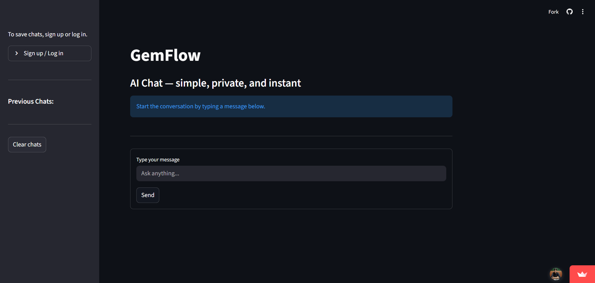

# GemFlow

GemFlow is a **full-stack AI chat application** built with **Streamlit**, **FastAPI**, **Supabase**, and **Google Gemini API**.  
It allows users to **sign up, log in, chat with AI, and save/reload chat history** — all in a clean, simple interface.

---

##  Live
 [GemFlow on Streamlit](https://gemflow.streamlit.app/)

---

## Screenshot

---

## Features
-  **Authentication** (Sign up / Log in via Supabase)
-  **Chat with Google Gemini** (Gemini 2.5 Flash model)
-  **Chat History** (saved per user in Supabase, reload anytime)
-  **Responsive UI** with Streamlit
-  **Deployment** on Streamlit Cloud (frontend)

---

## Tech Stack
- **Frontend:** Streamlit
- **Backend:** FastAPI
- **Database/Auth:** Supabase
- **AI Model:** Google Gemini API (`google-genai`)
- **Deployment:** Streamlit Cloud

